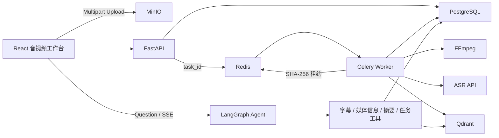

# AudiVise音视频语音内容理解平台

面向 AI 应用开发与 Agent 工程岗位的音视频语音内容理解项目。用户可以上传已有录音、播客或视频文件，系统异步完成音频标准化、ASR 转写、字幕切片、向量检索、AI 摘要与可追溯问答。

本项目理解的是音视频中的语音内容，不包含画面目标检测、OCR 或视觉多模态分析，也不采集浏览器麦克风录音。

## 技术栈

- FastAPI、Pydantic、SQLAlchemy、Alembic
- LangGraph、Function Calling 风格工具、SSE
- Celery、Redis、PostgreSQL
- MinIO、FFmpeg、Qdrant
- React、TypeScript、Vite
- pytest、Ruff、mypy、Docker Compose

## 核心能力

- 音频与视频大文件 Multipart 上传和断点续传。
- Celery 异步执行 FFmpeg、ASR、向量索引和摘要生成。
- 音视频统一转换为 16 kHz 单声道 MP3，复用同一 ASR 流水线。
- LangGraph 编排字幕检索、媒体信息、摘要和任务状态工具。
- 回答携带时间戳证据，可点击跳转到音频或视频时间点。
- trace_id 记录意图、工具、检索证据、节点耗时、模型输出和异常。
- PostgreSQL 活动任务唯一索引与 Redis 内容执行租约共同拦截重复处理。

## 内容级去重与容错

同一个媒体记录被并发提交时，PostgreSQL 部分唯一索引保证只存在一个活动任务，API 返回已有 `task_id`。

不同上传记录即使文件名不同，只要 SHA-256 相同，也会竞争同一个 Redis 租约：

```text
audivise:media:execution:{sha256}
```

租约使用随机 token，并通过 Lua 脚本校验 token 后续租或释放。Worker 每隔 30 秒续租，默认 TTL 为 90 秒，因此长视频转码超过初始 TTL 时不会让第二个 Worker 进入昂贵阶段。

未获取租约的任务由 Celery 指数退避重新投递。Celery 开启 late ack、worker lost reject 与 prefetch 1；Worker 崩溃后，消息会重新投递，旧租约过期后由新 Worker 接管。

流水线阶段具备幂等性：

- 已有音频产物时重新投递会从 MinIO 下载，不重复转码。
- 已有字幕分片时不重复调用 ASR。
- Qdrant 使用稳定 chunk ID 执行 upsert。
- 已有摘要时不重复调用 LLM。
- 每次 Worker 执行结束都会清理本地临时工作目录，正式文件保留在 MinIO。

## 系统流程



## 配置 ASR API

复制环境变量模板：

```powershell
Copy-Item .env.example .env
```

使用硅基流动时，在 `.env` 中填写：

```dotenv
DOVIDEO_ASR_API_URL=https://api.siliconflow.cn/v1/audio/transcriptions
DOVIDEO_ASR_API_KEY=your-api-key
DOVIDEO_ASR_MODEL=FunAudioLLM/SenseVoiceSmall
```

如果使用其他兼容供应商，把 URL、Key 和模型名替换为供应商提供的值即可。历史环境变量前缀 `DOVIDEO_` 为兼容现有部署而保留。

可选 LLM 配置：

```dotenv
DOVIDEO_LLM_BASE_URL=https://api.openai.com/v1
DOVIDEO_LLM_API_KEY=your-api-key
DOVIDEO_LLM_MODEL=your-chat-model
```

## Docker 启动

```powershell
docker compose up --build
```

访问：

- Web：[http://localhost:8080](http://localhost:8080)
- API 文档：[http://localhost:8000/docs](http://localhost:8000/docs)
- MinIO Console：[http://localhost:9001](http://localhost:9001)
- Qdrant Dashboard：[http://localhost:6333/dashboard](http://localhost:6333/dashboard)

租约参数可通过 Compose 或环境变量调整：

```dotenv
DOVIDEO_EXECUTION_LEASE_TTL_SECONDS=90
DOVIDEO_EXECUTION_LEASE_RENEW_INTERVAL_SECONDS=30
```

续租间隔必须小于 TTL。

## 本地开发

后端：

```powershell
cd backend
python -m venv .venv
.\.venv\Scripts\python.exe -m pip install -e ".[dev]"
.\.venv\Scripts\python.exe -m pytest
.\.venv\Scripts\python.exe -m uvicorn app.main:app --reload
```

前端：

```powershell
cd client
npm install
npm test
npm run build
npm run dev
```

## 主要 API

内部 API 为兼容原型继续保留 `/api/videos` 路径，但其资源可以是音频或视频。

| 方法 | 路径 | 作用 |
| --- | --- | --- |
| POST | `/api/uploads` | 创建音视频 Multipart 上传会话 |
| POST | `/api/uploads/{id}/parts` | 获取分片预签名 URL |
| POST | `/api/uploads/{id}/complete` | 完成上传并创建媒体记录 |
| GET | `/api/videos` | 获取媒体列表 |
| GET | `/api/videos/{id}/playback` | 获取播放地址 |
| POST | `/api/videos/{id}/analysis` | 创建或复用活动解析任务 |
| GET | `/api/tasks/{id}` | 查询任务进度 |
| GET | `/api/videos/{id}/transcript` | 获取时间戳字幕 |
| POST | `/api/videos/{id}/chat/stream` | 流式 Agent 问答 |
| GET | `/api/traces/{trace_id}` | 查询 Agent Trace |

## 测试

```powershell
cd backend
.\.venv\Scripts\python.exe -m pytest -q
.\.venv\Scripts\python.exe -m ruff check app tests
.\.venv\Scripts\python.exe -m mypy app

cd ..\client
npm test
npm run build
```

测试覆盖音视频 MIME 校验、活动任务复用、租约排他、长任务自动续租、token 安全释放、阶段恢复、临时文件清理、字幕检索、Agent Trace 与前端播放器切换。
